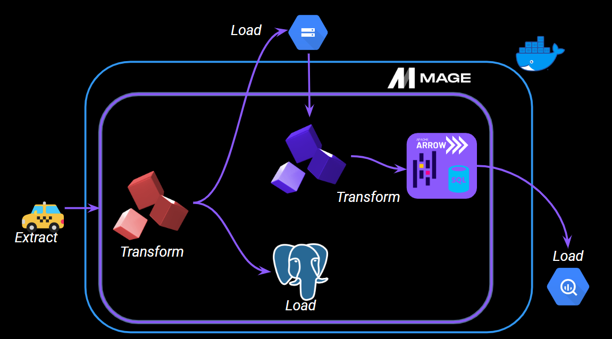
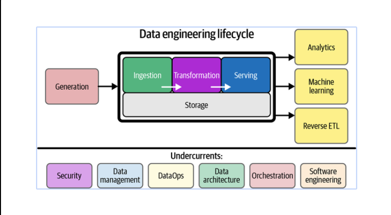
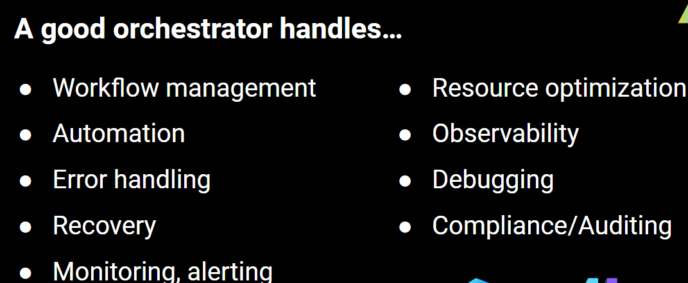
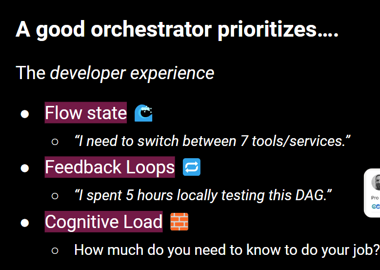

## Workflow Orchestration
2.2.1 - 📯 Intro to Orchestration

We will use Docker and Mage and a postgress database and in final project we're going to take a data set it's a New York Yellow Taxi Cab data set as illustrated by that
taxi do some Transformations on it and load it to postgress,load it to Google Cloud Storage,do transformation using open source tools like pandas,Apache Arrow,SQL then load
it to Google big query. Extracting transforming and loading data to multiple sources is one aspect of data Engineering
* **What is orchestration?**
A large part of data engineering is extracting transforming loading data between different sources.Orchestration is a process of dependency management facilitated through Automation.Data orchestrator manages scheduling triggering monitoring and resource allocation for data engineering workflows.Every workflow requires sequential steps.
Steps are called tasks or blocks.Workflows often called dag or a pipeline in data engineering.

Orchestration is one of the under currents and it happens throughout the entire life cycle of data engineering. A good orchestrator handles workflow management,Define schedule, ,ensure tasks are executed in the right order,manages dependencies,automate as much as possible,doing error handling and recovery.

Orchestrators need to come up with
built-in solutions for handling errors,conditional logic, branching,retrying failed tasks,recovery things,in case of  losing data, missing data, there needs to be a way to recover lost data.Orchestrators handle monitoring and alerting.If a pipeline fails or if those retries do fail,it will send you some sort of notification or has the capability.It also resource optimization if your orchestrator is managing where jobs are executed ,ideally it would play some role in optimizing the best route for that execution so resource optimization is another good characteristic to look forward in an orchestrator.observability, is a important piece into every part of the data Pipeline Debugging is a part of observability and your orchestrator should let you debug your data pipelines.Your orchestrator should help you with compliance or auditing 
Flow State feedback loops cognitive load. People talk about Flow State a lot.It's kind of like that feeling of flow almost effortless development maybe you've
experienced it with one of your passions or Hobbies like art or dance or music hopefully you've experienced it withengineering and work.If you're constantly needing to switch between tools you don't have a very good flow feedback loops, **the ability to iterate quickly to fail fast** and get tangible feedback immediatelyvery important .A good orchestrator accomplishes all of the data engineering tasks but alsofacilitates rapid and almost seamless development of data pipelines.Good analogy-->A good orchestrator is 
like a conductor in orchestra.

2.2.2 - 🧙‍♂️ Intro to Mage

2.2.3 - 🐘 ETL: API to Postgres

2.2.4 - 🤓 ETL: API to GCS

2.2.5 - 🔍 ETL: GCS to BigQuery

2.2.6 - 👨‍💻 Parameterized Execution

2.2.7 - 🤖 Deployment (Optional)

2.2.8 - 🧱 Advanced Blocks (Optional)

2.2.9 - 🗒️ Homework

2.2.10 - 👣 Next Steps