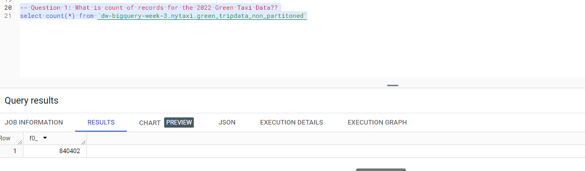
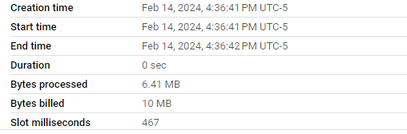
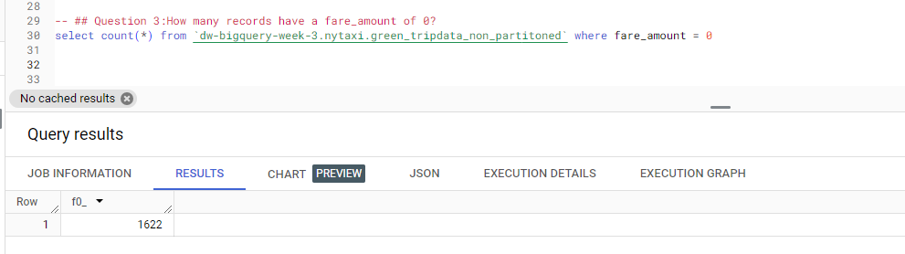
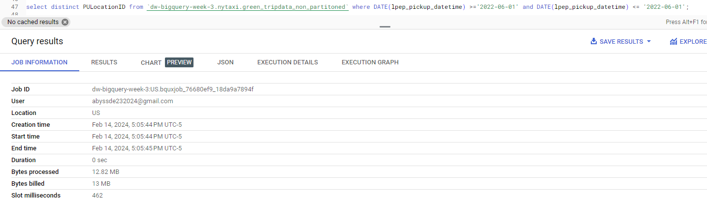
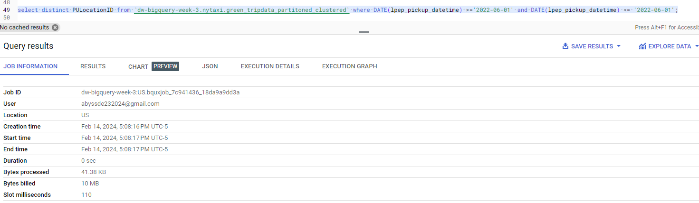
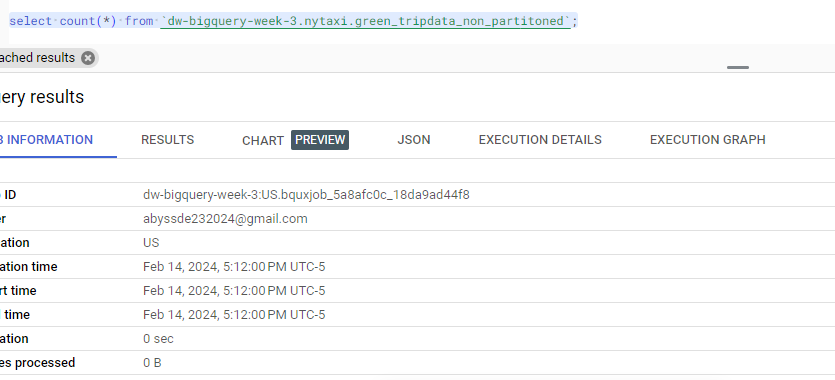

## Module 3 Homework

ATTENTION: At the end of the submission form, you will be required to include a link to your GitHub repository or other public code-hosting site. This repository should contain your code for solving the homework. If your solution includes code that is not in file format (such as SQL queries or shell commands), please include these directly in the README file of your repository.

**Important Note:** For this homework we will be using the 2022 Green Taxi Trip Record Parquet Files from the New York
City Taxi Data found here:  https://www.nyc.gov/site/tlc/about/tlc-trip-record-data.page 
If you are using orchestration such as Mage, Airflow or Prefect do not load the data into Big Query using the orchestrator. 
Stop with loading the files into a bucket. 
**NOTE:** You will need to use the PARQUET option files when creating an External Table

**SETUP:**
Create an external table using the Green Taxi Trip Records Data for 2022. 
Create a table in BQ using the Green Taxi Trip Records for 2022 (do not partition or cluster this table). 

## Question 1:
Question 1: What is count of records for the 2022 Green Taxi Data??

- 840,402


## Question 2:
Write a query to count the distinct number of PULocationIDs for the entire dataset on both the tables. 
What is the estimated amount of data that will be read when this query is executed on the External Table and the Table?

- 0 MB for the External Table and 6.41MB for the Materialized Table
* Materialized table-->



* External table


## Question 3:
How many records have a fare_amount of 0?

- 1,622




## Question 4:
What is the best strategy to make an optimized table in Big Query if your query will always order the results by PUlocationID and filter based on lpep_pickup_datetime? (Create a new table with this strategy)
- Partition by lpep_pickup_datetime  Cluster on PUlocationID

## Question 5:
Write a query to retrieve the distinct PULocationID between lpep_pickup_datetime
06/01/2022 and 06/30/2022 (inclusive)





Use the materialized table you created earlier in your from clause and note the estimated bytes. Now change the table in the from clause to the partitioned table you created for question 4 and note the estimated bytes processed. What are these values? 

Choose the answer which most closely matches. 

- 12.82 MB for non-partitioned table and 1.12 MB for the partitioned table


## Question 6: 
Where is the data stored in the External Table you created?

- GCP Bucket


## Question 7:
It is best practice in Big Query to always cluster your data:
- True


## (Bonus: Not worth points) Question 8:
No Points: Write a `SELECT count(*)` query FROM the materialized table you created. How many bytes does it estimate will be read? Why?



* It will be 0 byte since the record count information is stored in Metadata?


## Queries from Big query

```
-- Query public available table
-- SELECT station_id, name FROM
--     bigquery-public-data.new_york_citibike.citibike_stations
-- LIMIT 100;

-- Creating external table referring to gcs path
CREATE OR REPLACE EXTERNAL TABLE `dw-bigquery-week-3.nytaxi.external_green_tripdata`
OPTIONS (
  format = 'PARQUET',
  uris = ['gs://dw-bigquery-week-3-bq-green/green_tripdata_2022-*.parquet']
);

-- Check green trip data
SELECT * FROM dw-bigquery-week-3.nytaxi.external_green_tripdata limit 10;

-- Create a non partitioned table from external green table
CREATE OR REPLACE TABLE dw-bigquery-week-3.nytaxi.green_tripdata_non_partitoned AS
SELECT * FROM dw-bigquery-week-3.nytaxi.external_green_tripdata;

-- Question 1: What is count of records for the 2022 Green Taxi Data??-->840,402
select count(*) from `dw-bigquery-week-3.nytaxi.green_tripdata_non_partitoned`;

-- ## Question 2:Write a query to count the distinct number of PULocationIDs for the entire dataset on both the tables.
-- What is the estimated amount of data that will be read when this query is executed on the External Table and the Table?
select count(distinct PULocationID) from `dw-bigquery-week-3.nytaxi.green_tripdata_non_partitoned`;

select count(distinct PULocationID) from `dw-bigquery-week-3.nytaxi.external_green_tripdata`;

-- ## Question 3:How many records have a fare_amount of 0?
select count(*) from `dw-bigquery-week-3.nytaxi.green_tripdata_non_partitoned` where fare_amount = 0;

-- Question 4:What is the best strategy to make an optimized table in Big Query if your query will always order the results by PUlocationID and filter based on lpep_pickup_datetime? (Create a new table with this strategy)

-- Creating a partition and cluster table
CREATE OR REPLACE TABLE dw-bigquery-week-3.nytaxi.green_tripdata_partitoned_clustered
PARTITION BY DATE(lpep_pickup_datetime)
CLUSTER BY PULocationID AS
SELECT * FROM dw-bigquery-week-3.nytaxi.external_green_tripdata;

--
select DATE(lpep_pickup_datetime)
from `dw-bigquery-week-3.nytaxi.green_tripdata_non_partitoned`;
--

-- ## Question 5:Write a query to retrieve the distinct PULocationID between lpep_pickup_datetime 06/01/2022 and 06/30/2022 (inclusive)

select distinct PULocationID from `dw-bigquery-week-3.nytaxi.green_tripdata_non_partitoned` where DATE(lpep_pickup_datetime) >='2022-06-01' and DATE(lpep_pickup_datetime) <= '2022-06-01';

select distinct PULocationID from `dw-bigquery-week-3.nytaxi.green_tripdata_partitoned_clustered` where DATE(lpep_pickup_datetime) >='2022-06-01' and DATE(lpep_pickup_datetime) <= '2022-06-01';


--## (Bonus: Not worth points) Question 8:No Points: Write a `SELECT count(*)` query FROM the materialized table you created. How many bytes does it estimate will be read? Why?

select count(*) from `dw-bigquery-week-3.nytaxi.green_tripdata_non_partitoned`;
```

